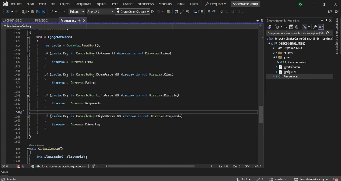

# Jogo da Cobrinha em C# 🐍

Jogo simples da cobrinha (Snake Game) desenvolvido com C# puro para ser jogado no console! 

## 📚 Alguns dos principais conceitos utilizados
- Thread
- Arrays bidimensionais 
- Estrutura de dados

## ⁉️ Como Jogar?
1. **Clone o repositório:**
    ```bash
    git clone https://github.com/joaov12/snakeGame_Csharp.git
    ```

2. **Execute o projeto:**
    ```bash
    dotnet run
    ```

## 🕹️ Controles
- **Setas direcionais:** Mova a cobra para cima, baixo, esquerda ou direita.
- O jogo inicia automaticamente ao executar o programa.
- Coma '*' para aumentar seu placar.
- Evite colidir com o próprio corpo da cobra!
- As bordas não são limitantes :) 
- Ao final do jogo, é exibido a sua pontuação

## 🎮 Jogando 



## 📜 Requisitos
- Ambiente de desenvolvimento C#.

## 📞 Contato
Use o meu linkedin caso queira entrar em contato comigo

[Meu LinkedIn - João Vitor Farias Soares](https://www.linkedin.com/in/jo%C3%A3o-vitor-farias-soares-216870238/)


